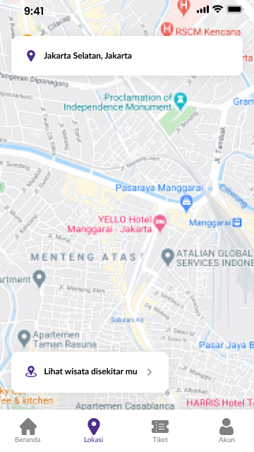

# Aplikasi Pencarian Wisata Berdasarkan titik kordinat User

## Deskripsi Masalah
- Sulitnya mengetahui / mencari tempat wisata disekitar

## Deskripsi Solusi
- Membuat aplikasi pencarian geospasial  untuk tempat-wisata disekitar berdasarkan titik kordinat user/pengguna

## Use Case
- User dapat melihat wisata terdekat/disekitar berdasarkan titik kordinat

## Struktur Data

### Wisata
Nama Atribut | Tipe Data | Contoh
---|---|---
UUID | string | ooj73849r734mf34r3
Nama Wisata | string | Transtudio Bandung
Kabupaten | string | Kota Bandung
Provinsi | String | Jawa Barat
🌏 Koordinat | poin | [106.03794 -6.39284693]
🌏 Area | polygon | [[106.03794 -6.39284693], [106.03794 -6.39284693], [106.03794 -6.39284693]]

### User
Nama Atribut | Tipe Data | Contoh
---|---|---
UUID | string | ooj73849r734mf34r3
Nama user | string | dahmun
Koordinat | poin | 106.03794 -6.39284693

## Mockup UX

